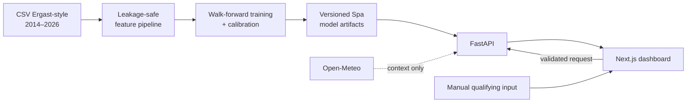

<div align="center">

# Belgian GP 2026 Podium Predictor

**Dashboard analitik dua tahap untuk membaca peluang podium Formula 1 di Spa-Francorchamps.**

<p>
  
  
  
  
</p>

<p>
  
  
  
  
</p>

[Fitur](#fitur-utama) · [Arsitektur](#arsitektur) · [Menjalankan lokal](#menjalankan-lokal) · [API](#api) · [Verifikasi](#verifikasi)

</div>

---

Dashboard ini menggabungkan form terkini, riwayat khusus Belgian GP, dan model *leakage-safe* untuk memprediksi P1, P2, serta P3. Prediksi awal tersedia sebelum qualifying; setelah sesi selesai, pengguna dapat memasukkan hasil qualifying dan grid final untuk menghitung ulang peluang podium seluruh pembalap.

## Fitur utama

- Dua mode prediksi: **pre-qualifying** dan **post-qualifying**.
- Simulasi 50.000 balapan tanpa pengembalian agar satu pembalap tidak mengisi lebih dari satu posisi podium.
- Probabilitas P1, P2, P3, podium, dan faktor model untuk seluruh grid 2026.
- Statistik khusus Spa: pole ke kemenangan, pole ke podium, korelasi qualifying–finis, DNF, serta rekam jejak pembalap dan tim.
- Workbench qualifying manual dengan validasi posisi unik, grid final, dan gap ke pole.
- Visual lintasan interaktif berisi sektor dan landmark utama Spa-Francorchamps.
- Forecast Open-Meteo sebagai konteks weekend, bukan sebagai fitur model v1.
- Layout responsif dengan tabel horizontal terisolasi dan form qualifying yang tetap nyaman di layar kecil.

## Cara kerja

| Tahap | Input | Output |
| --- | --- | --- |
| Sebelum qualifying | Data historis sampai British GP 2026 dan fixture pembalap aktif | Probabilitas awal P1/P2/P3 dan podium |
| Setelah qualifying | Posisi qualifying, grid final, dan gap ke pole | Probabilitas terbaru serta perubahan dalam poin persentase |

Pipeline hanya memakai informasi yang tersedia sebelum balapan. Fitur hasil balapan seperti `finish_gap_to_teammate_avg` tidak digunakan, sedangkan fitur form, konstruktor, dan klasemen digeser satu race untuk mencegah kebocoran target.

## Arsitektur



| Lapisan | Teknologi | Tanggung jawab |
| --- | --- | --- |
| Pipeline | Python, pandas, scikit-learn, LightGBM | Fitur historis, training, kalibrasi, dan simulasi |
| API | FastAPI, Pydantic | Kontrak data, validasi qualifying, dan inference |
| Web | Next.js 15, React 19, TypeScript | Dashboard, visual sirkuit, dan workbench interaktif |
| Test | pytest, Playwright | Unit/API contract, desktop flow, keyboard, dan mobile layout |

## Menjalankan lokal

### 1. Pipeline dan backend

```bash
python -m venv .venv
.venv/bin/pip install -r requirements.txt

# Opsional: latih ulang dan tulis artifact Spa v1
PYTHONPATH=src .venv/bin/python -m spa_pipeline.train

# Jalankan API pada http://127.0.0.1:8000
.venv/bin/python backend/run.py
```

Artifact siap pakai tersedia di `artifacts/spa/v1`, sehingga retraining tidak diperlukan untuk sekadar menjalankan dashboard.

### 2. Frontend

Di terminal lain:

```bash
cd frontend
npm install
npm run dev
```

Buka `http://localhost:3000`. Salin `frontend/.env.example` bila URL API perlu disesuaikan.

## API

Dokumentasi interaktif tersedia di `http://localhost:8000/docs` saat backend aktif.

| Method | Endpoint | Fungsi |
| --- | --- | --- |
| `GET` | `/api/health` | Status API, artifact, versi model, dan data cutoff |
| `GET` | `/api/spa/overview` | Detail event, jadwal, sirkuit, model, dan cuaca |
| `GET` | `/api/spa/history` | Statistik qualifying/grid khusus Belgian GP |
| `GET` | `/api/spa/predictions/pre-qualifying` | Prediksi awal seluruh grid |
| `POST` | `/api/spa/predictions/post-qualifying` | Prediksi setelah input qualifying tervalidasi |

## Verifikasi

```bash
# Unit dan API contract
.venv/bin/python -m pytest

# Static checks dan production build
cd frontend
npm run typecheck
npm run build

# Browser E2E; otomatis menjalankan FastAPI dan Next.js
npm run test:e2e
```

Status terakhir yang diverifikasi secara lokal:

- `9 passed` — pytest.
- `7 passed` — Playwright Chromium.
- TypeScript typecheck dan Next.js production build lulus.

## Struktur proyek

```text
├── artifacts/spa/v1/      # Bundle model, fixture, manifest, dan prediksi awal
├── backend/app/           # FastAPI routes, schemas, dan services
├── data/                  # Dataset historis dan processed feature frame
├── frontend/              # Next.js App Router dashboard
├── reports/spa/           # Walk-forward dan statistik historis Spa
├── src/spa_pipeline/      # Feature engineering, modeling, history, dan training
└── tests/                 # Test Python dan API contract
```

## Batasan

- Produk ini khusus Belgian GP 2026 dan belum dirancang sebagai predictor semua sirkuit.
- Belgian GP 2021 dikeluarkan dari statistik default karena karakter race yang tidak representatif.
- Forecast cuaca hanya ditampilkan sebagai konteks dan belum memengaruhi probabilitas model.
- Probabilitas adalah estimasi analitis berdasarkan data historis, bukan kepastian hasil atau saran taruhan.
